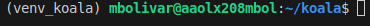
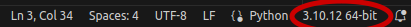
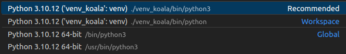
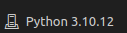

Running PyKOALA in a Python virtual environment
===============================================

What is a virtual environment?
------------------------------

A Python virtual environment is an isolated setup containing a specific Python interpreter and its dependencies, separate from the system’s global Python setup. It enables projects to have their own set of dependencies without interfering with other projects or the system-wide Python installation.
**It enables projects to have their own set of dependencies without interfering with other projects or the system-wide Python installation**. Python environments, like virtual environments or Docker, offer these key benefits:

1. **Isolation**: Keeps dependencies separate, avoiding conflicts.
2. **Dependency Management**: Easily manage dependencies for each project.
3. **Reproducibility**: Ensures consistent environments for development and deployment.
4. **Portability**: Makes projects easily shareable and deployable on different systems.
5. **Conflict Resolution**: Allows experimentation with different package versions.
6. **Security**: Enhances security by limiting system-level access.

In essence, they provide a structured and controlled way to manage dependencies, leading to more reliable projects.

Installation
------------

From the terminal, enter in the PyKOALA directory and type:

::

    python3 -m venv venv_koala

This will create named ``venv_koala`` with the neccesary files to activate and use the environmet. To activate it, use:

::

    source venv_koala/bin/activate

Then install all required packages with:

::

    pip install -r requirements.txt ; pip install . 

The second command will also install PyKOALA in the virtual environment. Furthermore, you can install any other Python modules with pip (seaborn, Bokeh, etc.)

While the environment is active, you will see ``(venv_koala)`` before the system username: 

When you are finished with the session in PyKOALA, you can deactivate the environment using:

::

    deactivate

You do not need to reinstall the packages every time you activate it, they will be there anytime you reactivate it!

Using VS Code in a virtual environment
--------------------------------------

If you use Visual Studio Code, you need to specify which environment you will use, even if it is already activated. 
When working with Python scripts, select in the bottom right the installed version:     

Once you do, at the top center a tab with the list of available environments will open, then select ``venv_koala`` (recommended version if possible):

When working with Jupyter notebooks in VS Code, you can select the environment in the top right buttom:

Once selected, the same tab with the environment list will appear. 