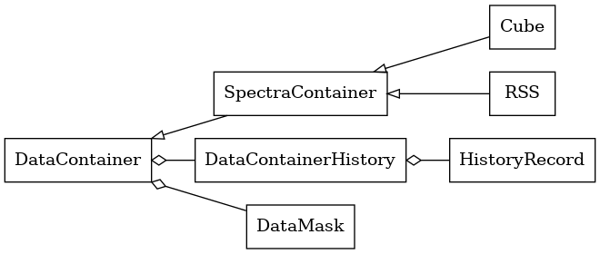
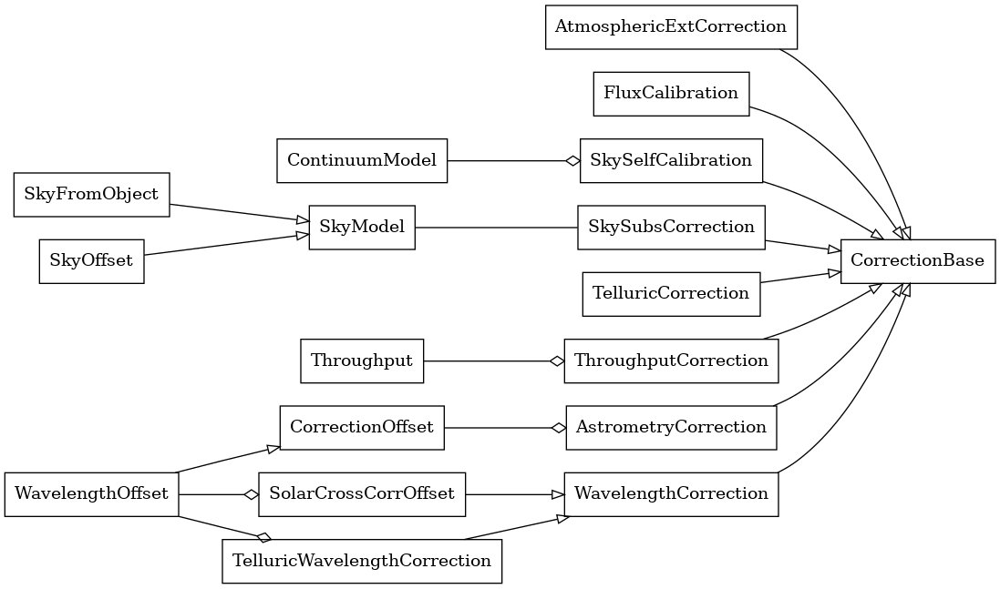

Introduction
============

Integral Field Spectroscopy (IFS) has emerged as a transformative technique in astronomical research, enabling simultaneous spatial and spectral data acquisition across an extended field of view 
via creating complete three-dimensional view of astronomical objects.
This capability has revolutionized our understanding of the Universe by facilitating studies of complex astrophysical phenomena, especially in the field of galaxy formation and evolution (Sanchez+21).

Over the past two decades, advances in instrumentation and data processing have positioned IFS at the forefront of observational astronomy.
Flagship IFS surveys and instruments like the Calar Alto Legacy Integral Field Area (CALIFA) survey (Sanchez+12) with PMAS/PPAK (Kelz+06), the many observational programmes carried out by the Multi-Unit Spectroscopic Explorer (Bacon+10) at the Very Large Telescope, the SAMI Galaxy Survey (Croom+12),
or the MaNGA survey (Drory+15), (Bundy+15) have demonstrated the power of IFS in delivering unprecedented insights into the nature of galaxies and their environments.

The wealth of data generated by IFS requires sophisticated reduction pipelines to transform raw measurements into scientifically useful information (Weilbacher+20).
This process encompasses multiple steps: correcting instrumental and atmospheric effects, calibrating fluxes, building 3D datacubes.
Each instrument poses specific requirements for these tasks, often addressed by custom software and expertise.
The Kilofibre Optical AAT Lenslet Array instrument (Ellis+12), mounted at the Anglo-Australian Telescope (AAT), is an Integral Field Unit (IFU) feeding the double-beam AAOmega spectrograph (Smith+04)
that perfectly exemplifies these challenges.
KOALA+AAOmega versatility (multiple gratings, central wavelengths, field of view) adds layers of complexity to the data reduction process.

The diversity and complexity of IFS instruments sets a significant barrier to the scientific exploitation of these data.
To mitigate this issue, the PyKOALA project started as a bespoke data reduction package for KOALA+AAOmega, but now it has grown to become a comprehensive, instrument-agnostic solution for IFS data reduction.
This paper introduces PyKOALA, detailing its philosophy, structure, and current features.

PyKOALA
^^^^^^^

The core design principles of PyKOALA are threefold: to provide a comprehensive framework adaptable to any IFS instrument; to establish a modular and extensible structure enabling customized workflows; and to enhance user accessibility through detailed documentation and tutorials.

Astronomical data in PyKOALA are represented by :ref:`data-container` objects--- an abstract interface designed to offer a uniform and efficient means of handling observations from various instruments. PyKOALA's API includes support for two widely used formats in IFS:

* **Row-Stacked Spectra** (:class:`pykoala.data_container.RSS`), which represent the spectra collected by each individual fibre in the IFU after tracing and extraction from the raw exposures.

* **Datacubes** (:class:`pykoala.data_container.Cube`), a 3D grid representation of spectra sampled along one spectral and two spatial dimensions.

    `UML <https://en.wikipedia.org/wiki/Unified_Modeling_Language>`_ diagram of PyKOALA's :ref:`data-container` model.

Since PyKOALA's development has been significantly driven by the requirements of KOALA+AAOmega, its initial focus has been on processing wavelength-calibrated RSS and datacubes, although the algorithmic implementation has been tested with other instruments (Hector and WEAVE).
For KOALA+AAOmega data, the library includes dedicated methods for reading the RSS files produced by the `2dfdr <https://ui.adsabs.harvard.edu/abs/2015ascl.soft05015A/abstract>`_ pipeline.
For data from other instruments, users can integrate PyKOALA by providing an interface (e.g., a wrapper function) to extract necessary information -- such as fibre spectra, wavelength, and variance arrays -- from the instrument's data files.
These inputs can then be used to instantiate an RSS class, leveraging the existing framework that provides an efficient integration.

Reduction steps in PyKOALA, such as :ref:`atmospheric extinction <atmospheric_extinction>` correction, :ref:`sky subtraction <sky>`, or :ref:`astrometry <astrometry>` adjustments are implemented via specialized :ref:`corrections`.
This modular approach provides a flexible and intuitive framework, allowing users to easily define and customize data reduction sequences.
PyKOALA currently supports the following corrections: atmospheric effects such as extinction, sky emission, and telluric absorption; astrometry offset corrections; wavelength offset corrections; and flux calibration.

    `UML <https://en.wikipedia.org/wiki/Unified_Modeling_Language>`_ diagram of PyKOALA's available :ref:`corrections`.

PyKOALA also supports the interpolation of individual RSS exposures into 3D datacubes, offering users the flexibility to choose between inverse-distance weighted methods and alternative techniques, such as drizzling.
